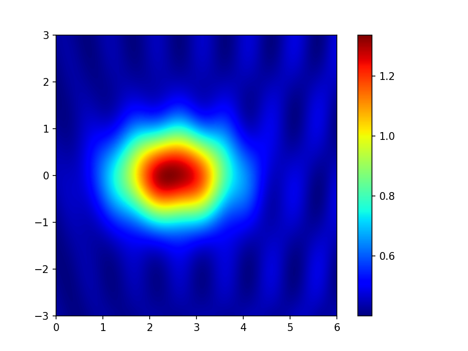
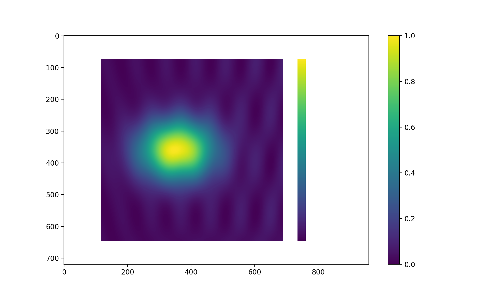
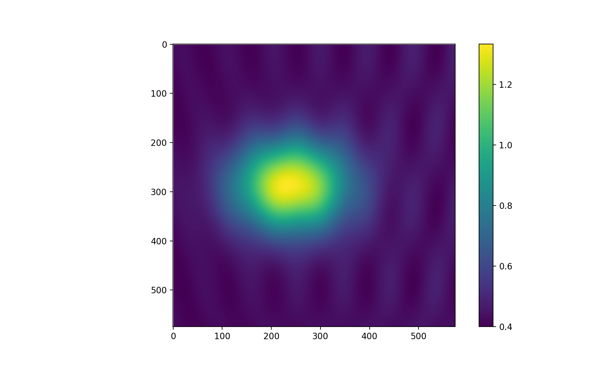
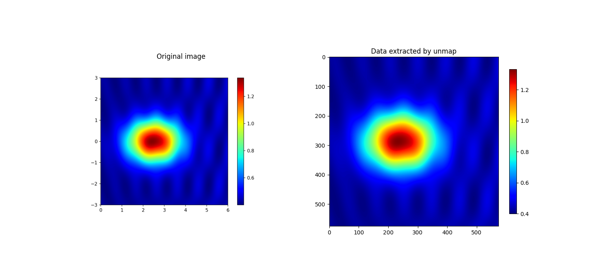

# unmap

[](https://github.com/kwinkunks/unmap/actions/workflows/run-tests.yml)
[](https://github.com/kwinkunks/unmap/actions/workflows/build-docs.yml)
[](https://pypi.org/project/unmap//)
[](https://pypi.org/project/unmap//)
[](https://pypi.org/project/unmap/)


Unmap data from pseudocolor images, with knowledge of the colourmap (for now!).


## Installation

You can install this package with `pip`:

    pip install unmap


## Documentation

Read [the documentation](https://kwinkunks.github.io/unmap)


## Example

Let's grab an image from the web and unmap it. First we'll download the image:

```python
from io import BytesIO

import requests
import numpy as np
from PIL import Image
import matplotlib.pyplot as plt


def get_image_from_web(uri):
    data = requests.get(uri).content
    img = Image.open(BytesIO(data)).convert('RGB')
    rgb_im = np.asarray(img)[..., :3] / 255.
    return rgb_im

# An image from Hugh Pumprey's blog post Colours for Contours, licensed CC BY
# https://blogs.ed.ac.uk/hughpumphrey/2017/06/29/colours-for-contours/
uri = 'https://blogs.ed.ac.uk/hughpumphrey/wp-content/uploads/sites/958/2017/06/jeti.png'
img = get_image_from_web(uri)
```

The image looks like this:



Now we'll unmap it:

```python
import unmap

data = unmap.unmap(img, cmap='jet')
plt.imshow(data)
```

This results in:



Notice that the data is there, but so is the colourbar. Also, the new data's colourbar shows that our dataset ranges from 0 to 1, but we can see from the colourbar in the original plot that it should range from about 0.4 to 1.333. So let's add `vrange` and `crop` arguments to deal with these issues:

```python
data = unmap.unmap(img, cmap='jet', vrange=(0.400, 1.333), crop=(115, 72, 690, 647))
```

Which gives us:



We could even plot this side by side with the original data, using the same colourmap, as a rough QC:



The extents of the data area are different. We could pass the `extent` argument to `plt.imshow` to fix this, but an even better idea is to put the data in an `xarray.DataArray`, because then the coordinates are attached to the data in a much more useful way. You could do this on your own, or you can use the Gio library's `unmap_to_dataarray()` function to do it for you.


## Testing

You can run the tests (requires `pytest` and `pytest-cov`) with

    pytest


## Building

This repo uses PEP 517-style packaging. [Read more about this](https://setuptools.pypa.io/en/latest/build_meta.html) and [about Python packaging in general](https://packaging.python.org/en/latest/tutorials/packaging-projects/).

Building the project requires `build`, so first:

    pip install build

Then to build `unmap` locally:

    python -m build

The builds both `.tar.gz` and `.whl` files, either of which you can install with `pip`.
